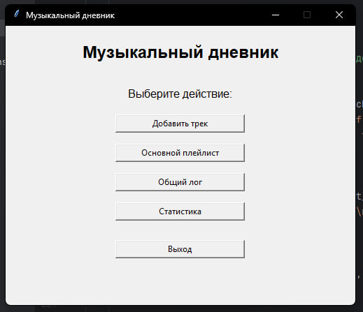

# Музыкальный дневник

Программа для сохранения и анализа прослушанных музыкальных треков, разработанная на Python с использованием библиотеки Tkinter.

---

## Описание проекта

Музыкальный дневник — это приложение с графическим интерфейсом, предназначенное для ведения записей о прослушанных композициях. Пользователь может вводить информацию о треках, выставлять оценки и сохранять комментарии.

Программа автоматически распределяет треки:
- оценка 5 — основной плейлист;
- оценка ниже 5 — общий журнал.

Все данные сохраняются в файл JSON, а действия пользователя записываются в отдельный лог-файл.

---

## Возможности

- добавление новых треков;
- оценка треков по шкале от 1 до 5;
- автоматическое распределение записей;
- просмотр всех записей;
- просмотр основного плейлиста;
- просмотр статистики;
- сохранение данных в файл;
- логирование действий.

---

## Интерфейс программы

### Главное окно


### Добавление трека


### Статистика


---

## Use Case

Пользователь запускает программу и попадает в главное окно. Далее он выбирает добавление нового трека, вводит данные и сохраняет запись. Программа проверяет корректность введённых данных и сохраняет их в файл. В зависимости от оценки запись попадает либо в основной плейлист, либо в общий журнал. Пользователь также может просматривать все записи и статистику.

---

## Технологии

- Python
- Tkinter
- JSON
- logging

---

## Запуск программы

```bash
python main.py
